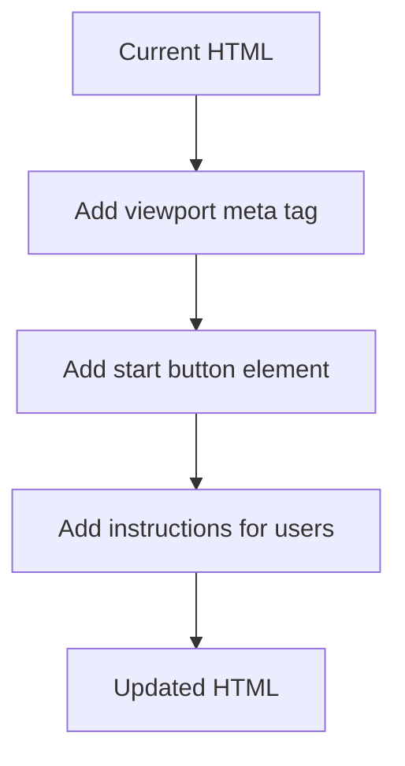
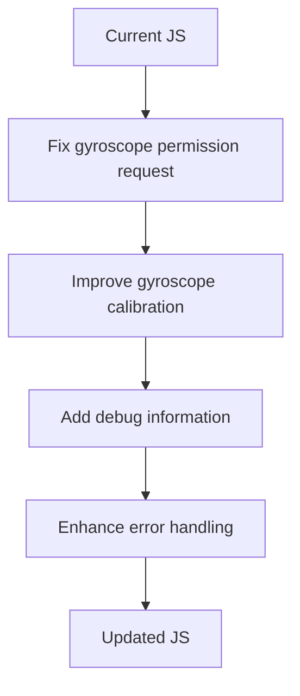
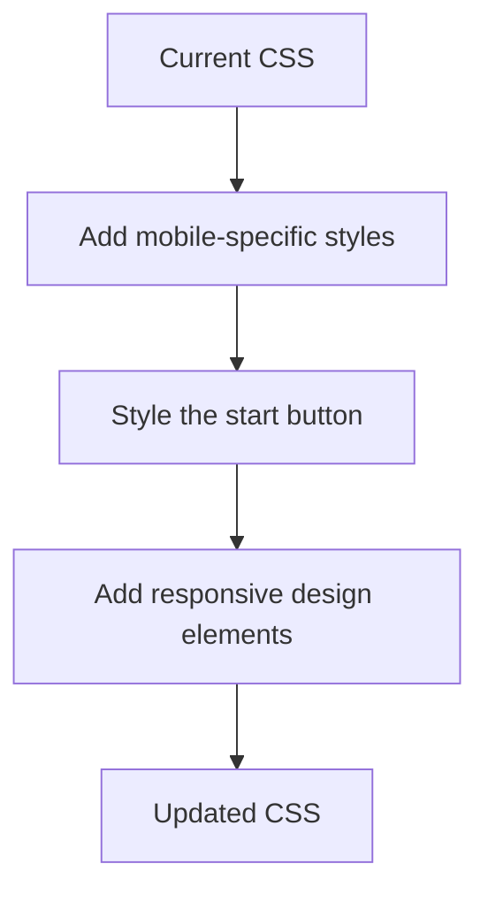
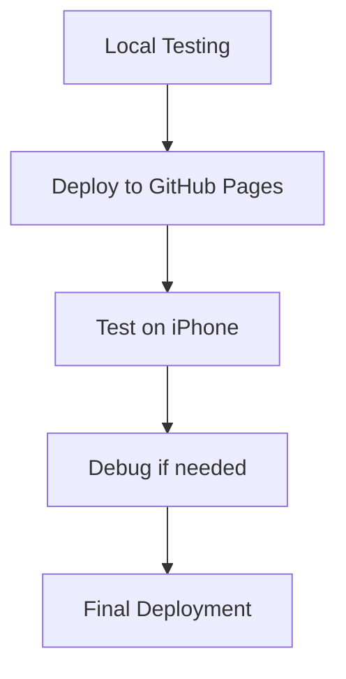

# Gyroscope Implementation Plan for Paddle Control

## Current Issues Identified

1. The HTML file doesn't contain the "startButton" element that's referenced in the JavaScript code.
2. The gyroscope permission request is never triggered because the button doesn't exist.
3. The game may not be properly initializing the gyroscope controls.
4. There might be issues with how the gyroscope values are being applied to the paddle movement.

## Detailed Implementation Plan

### 1. Update the HTML Structure

We need to add a proper start button and ensure the HTML has the necessary meta tags for mobile devices:



**Specific Changes:**

- Add a proper viewport meta tag for mobile devices
- Create a visible start button with clear instructions
- Add a debug area to display gyroscope values (helpful for troubleshooting)

### 2. Enhance the JavaScript Gyroscope Implementation



**Specific Changes:**

- Ensure the gyroscope permission request works correctly on iOS
- Improve the calibration of the gyroscope offset
- Add better error handling and debugging information
- Make the paddle movement smoother and more responsive

### 3. Improve the CSS for Mobile Experience



**Specific Changes:**

- Ensure the game is properly sized for mobile screens
- Style the start button to be easily tappable on mobile
- Add visual feedback for gyroscope activity

### 4. Testing and Deployment Process



**Specific Steps:**

- Test locally using mobile device emulation
- Deploy to GitHub Pages
- Test on actual iPhone 13 with iOS 15
- Debug any issues that arise
- Make final adjustments and redeploy

## Implementation Details

### HTML Changes

```html
<!DOCTYPE html>
<html>
  <head>
    <title>testgame</title>
    <meta charset="UTF-8" />
    <meta
      name="viewport"
      content="width=device-width, initial-scale=1.0, maximum-scale=1.0, user-scalable=no"
    />
    <link rel="stylesheet" href="style.css" />
  </head>
  <body>
    <div id="game-container">
      <canvas id="gameCanvas" width="800" height="600"></canvas>
      <button id="startButton">Tap to Start Game</button>
      <div id="debug-info"></div>
    </div>
    <script src="script.js"></script>
  </body>
</html>
```

### JavaScript Enhancements

Key areas to modify in the JavaScript:

1. **Improved Gyroscope Permission Request:**

```javascript
function requestGyroPermission() {
  if (typeof DeviceOrientationEvent.requestPermission === "function") {
    // iOS 13+ requires permission request
    DeviceOrientationEvent.requestPermission()
      .then((permissionState) => {
        if (permissionState === "granted") {
          window.addEventListener("deviceorientation", handleOrientation);
          document.getElementById("debug-info").textContent =
            "Gyroscope permission granted";
        } else {
          document.getElementById("debug-info").textContent =
            "Gyroscope permission denied";
        }
      })
      .catch((error) => {
        document.getElementById("debug-info").textContent =
          "Error requesting permission: " + error;
      });
  } else {
    // Non-iOS or older iOS doesn't need permission
    window.addEventListener("deviceorientation", handleOrientation);
    document.getElementById("debug-info").textContent =
      "Gyroscope active (no permission needed)";
  }
}
```

2. **Better Gyroscope Handling:**

```javascript
function handleOrientation(event) {
  // For debugging
  const debugInfo = document.getElementById("debug-info");

  // Get gamma (left-right tilt)
  let gamma = event.gamma;

  // Display raw values for debugging
  debugInfo.textContent = `Gamma: ${gamma.toFixed(2)}°`;

  // Initialize offset on first reading
  if (gammaOffset === null && gamma !== null) {
    gammaOffset = gamma;
    debugInfo.textContent += ` | Offset: ${gammaOffset.toFixed(2)}°`;
  }

  // Apply offset and calculate paddle movement
  gamma -= gammaOffset ?? 0;

  // Move paddle based on tilt
  paddleX += gamma * paddleSpeedMultiplier;

  // Keep paddle within canvas boundaries
  paddleX = Math.max(0, Math.min(canvas.width - paddleWidth, paddleX));
}
```

### CSS Improvements

```css
body {
  margin: 0;
  background-color: #132849;
  overflow: hidden;
  display: flex;
  justify-content: center;
  align-items: center;
  height: 100vh;
  touch-action: none; /* Prevent browser handling of touch gestures */
}

#game-container {
  position: relative;
  width: 100%;
  max-width: 800px;
  height: auto;
  display: flex;
  flex-direction: column;
  align-items: center;
}

canvas {
  border: 3px solid #ff0000;
  background-color: #555555;
  width: 100%;
  height: auto;
  max-height: 90vh;
}

#startButton {
  position: absolute;
  top: 50%;
  left: 50%;
  transform: translate(-50%, -50%);
  padding: 15px 30px;
  background-color: #0095dd;
  color: white;
  border: none;
  border-radius: 5px;
  font-size: 20px;
  cursor: pointer;
  z-index: 10;
}

#debug-info {
  position: absolute;
  bottom: 10px;
  left: 10px;
  color: white;
  background-color: rgba(0, 0, 0, 0.5);
  padding: 5px;
  border-radius: 3px;
  font-family: monospace;
  font-size: 12px;
}
```

## GitHub Pages Considerations

1. Ensure all files are properly committed and pushed to the repository
2. Make sure the repository is configured for GitHub Pages (Settings > Pages)
3. The site must be served over HTTPS for the gyroscope to work (GitHub Pages does this automatically)
4. Test the deployed site on the actual device, not just in development

## Troubleshooting Guide

If the gyroscope still doesn't work after implementation:

1. Check the debug info area for error messages
2. Verify that the permission request is being triggered (look for browser permission dialog)
3. Try different orientations of the device
4. Ensure the device is not in any power-saving mode that might disable sensors
5. Test with different sensitivity values by adjusting the `paddleSpeedMultiplier`

## Next Steps

After implementing these changes, we should:

1. Test thoroughly on the iPhone 13 with iOS 15
2. Consider adding additional features like sensitivity adjustment
3. Add visual indicators for when the gyroscope is active
4. Consider fallback controls (touch/swipe) for devices without gyroscope support
